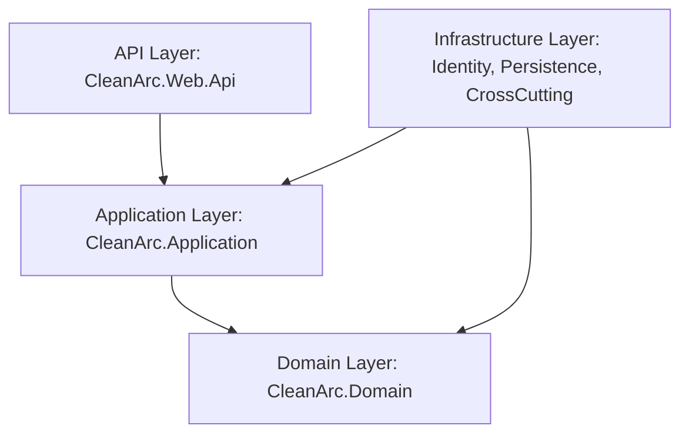

# Vega B2B Backend System

Vega B2B is a gamified, adaptive language learning platform. The backend is built on **.NET 8** following **Clean Architecture**, **CQRS (Command Query Responsibility Segregation)**, and **Domain-Driven Design (DDD)** principles to provide a scalable, secure, and performant service.

---

## 🏛️ Architecture Overview

The system strictly adheres to Clean Architecture, keeping the core business logic independent of external frameworks, databases, and UI layers.



### Layer Dependency Rules
*   **API** $\rightarrow$ **Application** $\rightarrow$ **Domain** *(Allowed)*
*   **Infrastructure** $\rightarrow$ **Domain** / **Application** *(Allowed — implements contracts)*
*   **Domain** has no dependencies on other projects *(Strict Rule)*
*   **Application** cannot depend on **Infrastructure** directly; it interacts solely via interfaces defined in the Application contracts.

---

## 📂 Repository Structure

The project code is organized as follows:

```
vega-backend/src/
├── Core/
│   ├── CleanArc.Domain/                 # Core Domain Entities (no external dependencies)
│   │   ├── Common/BaseEntity.cs         # Audit logs, BaseEntity, IEntity
│   │   └── Entities/                    # Bounded contexts: User, Adaptive, Quiz, Institution
│   └── CleanArc.Application/            # Business Logic & CQRS Pipelines
│       ├── Features/                    # Mediator Handlers organized by Bounded Context
│       ├── Contracts/                   # Interfaces (IUnitOfWork, IRepository, AI services)
│       ├── Models/Common/               # OperationResult Result Monad
│       └── Profiles/                    # AutoMapper Profile mapping
├── Infrastructure/
│   ├── CleanArc.Infrastructure.Persistence/ # Entity Framework Core and Data Stores
│   │   ├── ApplicationDbContext.cs      # Database Context & SQL configurations
│   │   ├── Repositories/                # Database Repository Implementations
│   │   └── Services/                    # Adaptive Challenge engines & AI pipeline services
│   └── CleanArc.Infrastructure.Identity/    # Identity Server configuration
│       ├── Identity/                    # ASP.NET Identity (Roles, Claims, Seeding)
│       └── Jwt/                         # JWT Token Service
└── API/
    └── CleanArc.Web.Api/                # Carter Routing Modules & Controllers
        ├── Modules/                     # Carter ICarterModule Endpoint Modules (REST endpoints)
        ├── Scripts/SchemaRepairs/       # Custom SQLite Schema Repair Scripts
        └── Program.cs                   # Application Bootstrapper
```

---

## ⚙️ Core Design Patterns & System Principles

### 1. CQRS Command & Query Pattern (via Mediator)
Every database modification or data fetch operation runs through a pipeline using Mediator. Handlers are defined in the same file as their commands to keep features cohesive and maintainable.
*   **Commands & Queries**: Declared as `public sealed record` objects.
*   **Handlers**: Declared as `internal sealed class` implementations.
*   **Entity Framework Context**: Handlers never inject `ApplicationDbContext` directly; they always interact through [IUnitOfWork](file:///C:/Users/JackyLoh716/Desktop/Y4S2_FYP/vega-backend/src/Core/CleanArc.Application/Contracts/Persistence/IUnitOfWork.cs).

### 2. OperationResult Monad (Cross-Layer Results)
To avoid throwing custom exceptions for expected domain errors (e.g. resource not found, forbidden operations), handlers return [OperationResult<T>](file:///C:/Users/JackyLoh716/Desktop/Y4S2_FYP/vega-backend/src/Core/CleanArc.Application/Models/Common/OperationResult.cs).
*   `SuccessResult(value)` $\rightarrow$ maps to `200 OK`
*   `FailureResult(message)` $\rightarrow$ maps to `400 Bad Request`
*   `UnauthorizedResult(message)` $\rightarrow$ maps to `401 Unauthorized`
*   `ForbiddenResult(message)` $\rightarrow$ maps to `403 Forbidden`
*   `NotFoundResult(message)` $\rightarrow$ maps to `404 Not Found`

### 3. Modular Carter Route Endpoints
Instead of traditional bloated controllers, route mapping is handled using `ICarterModule` configurations in `CleanArc.Web.Api/Modules/`. Endpoints are lightweight and versioned explicitly.

### 4. Dynamic Token Claim and Role Mapping
Roles are defined in the [RoleNames](file:///C:/Users/JackyLoh716/Desktop/Y4S2_FYP/vega-backend/src/Core/CleanArc.Application/Contracts/Identity/RoleNames.cs) static class (`student`, `teacher`, and `institution_admin`).
*   To prevent cross-role bypasses and endpoint lockouts, [AppUserClaimsPrincipleFactory](file:///C:/Users/JackyLoh716/Desktop/Y4S2_FYP/vega-backend/src/Infrastructure/CleanArc.Infrastructure.Identity/Identity/AppUserClaimsPrincipleFactory.cs) and [ServiceCollectionExtension](file:///C:/Users/JackyLoh716/Desktop/Y4S2_FYP/vega-backend/src/Infrastructure/CleanArc.Infrastructure.Identity/ServiceConfiguration/ServiceCollectionExtension.cs) map `admin` and `institution_admin` roles dynamically to each other.

---

## ⚡ Core Functional Modules

### 🧠 1. Adaptive Challenge Engine
Generates and assigns learning challenges based on individual student performance.
*   **Adaptive Strategies**: Evaluates student weakness matrices and translates syllabus content into interactive games:
    *   *Spell Catcher* (Spelling validation and recall)
    *   *Syllable Sushi* (Syllable parsing and segment grouping)
    *   *Voice Bridge* (Pronunciation/speech validation)
    *   *Echo Sequence* (Audio comprehension and visual memory)
    *   *Translation* (Bilingual word translations)
*   **Key Services**: [ChallengeGenerator](file:///C:/Users/JackyLoh716/Desktop/Y4S2_FYP/vega-backend/src/Infrastructure/CleanArc.Infrastructure.Persistence/Services/Adaptive/ChallengeGenerator.cs) and [ChallengeOrchestrator](file:///C:/Users/JackyLoh716/Desktop/Y4S2_FYP/vega-backend/src/Infrastructure/CleanArc.Infrastructure.Persistence/Services/Adaptive/ChallengeOrchestrator.cs).
*   **JSON Resiliency**: [ChallengeContentNormalizer](file:///C:/Users/JackyLoh716/Desktop/Y4S2_FYP/vega-backend/src/Core/CleanArc.Application/Features/Games/Commands/ChallengeContentNormalizer.cs) cleans and normalizes AI generated quiz JSON formats, correcting common discrepancies in property names (e.g. mapping `translation`, `targetWord`, `text` keys automatically to `word`).

### 🏫 2. Classroom & Module Management
*   Provides modular syllabus tracking for classrooms.
*   Restricts join codes to users with the `student` role.
*   Imposes a limit of **3 challenges** per syllabus module on predefined structures, but allows unlimited custom challenges on custom library modules.

### 💳 3. Billing & Seat capacity checks
*   Secures subscription limits for institutions.
*   Before generating or bulk-creating student/educator accounts, checks the institution subscription capacity against the maximum seats allowed (`MaxSeats`).

### 🤖 4. AI Hub Service Pipeline
*   Orchestrates LLM generation (via Google Gemini) for quiz plans and syllabus translation content.
*   Incorporates monthly AI token rate-limiting quotas on a per-user level.
*   Logs all generated prompts, parameters, and token cost usage details into database audit files (`AiUsageLog` / `AiAuditLog`).

---

## 🛠️ Developer Setup & Commands

### 1. Build the Solution
Compile the projects to verify code cleanliness:
```bash
dotnet build
```

### 2. Run Test Suites
The project includes a robust suite of unit and integration tests covering security, AI generation, and database limits:
```bash
dotnet test
```

### 3. Database Schema Migration and Repair
We use Entity Framework Core for persistence migrations. Additionally, dynamic SQL schema scripts (such as [20260630_RemoveLegacyClassroomMetadataColumns.sql](file:///C:/Users/JackyLoh716/Desktop/Y4S2_FYP/vega-backend/src/API/CleanArc.Web.Api/Scripts/SchemaRepairs/20260630_RemoveLegacyClassroomMetadataColumns.sql)) run automatically at startup to repair legacy columns.
*   **Create Migration**:
    ```bash
    dotnet ef migrations add <MigrationName> -p src/Infrastructure/CleanArc.Infrastructure.Persistence -s src/API/CleanArc.Web.Api
    ```
*   **Apply Migration**:
    ```bash
    dotnet ef database update -p src/Infrastructure/CleanArc.Infrastructure.Persistence -s src/API/CleanArc.Web.Api
    ```

### 4. Running the Development Server
```bash
cd src/API/CleanArc.Web.Api
dotnet run
```

---

## 🔗 Development References
*   [Guide to Creating a New API in Clean Architecture](file:///C:/Users/JackyLoh716/Desktop/Y4S2_FYP/vega-backend/docs/creating_new_api_guide.md)
